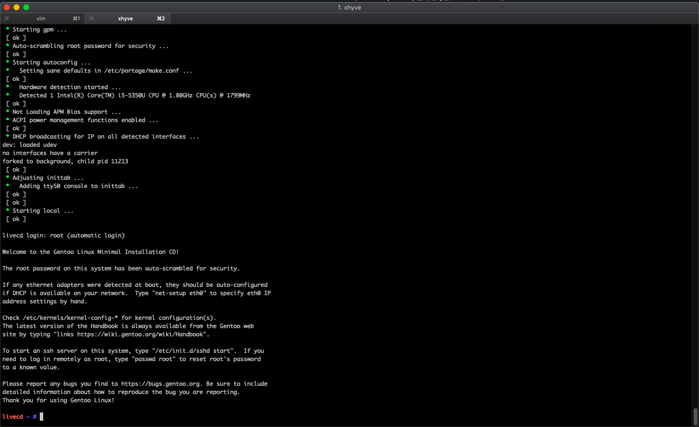

# xhyve-script


## Xhyve 使用

因为不想用virtualbox点点点虽然有命令行（
看到了这个xhyve感觉还不错这里记录一下咋用

这里是我的目录树结构
```sh
vms/
├── disk
├── iso
├── kernel
│   ├── gentoo
│   └── run
│       └── gentoo
└── script
```

vms是总的文件夹

disk就是存放映像文件
iso就是存放dvd的
kernel就是存放引导需要的内核和initram
gentoo 这个是存放Gentoo安装时的内核
run 下面的是运行时的内核
script 是存放启动或者创建时的脚本


### 1. 制作ISO
因为启动需要vmlinuz和initramfs所以需要先把安装节制的这两个东东搞出来


这里以Gentoo为例子，因为用到最多的也就是Gentoo


```sh
cd /vms/iso
dd if=/dev/zero bs=2k count=1 of=./gentoo_tmp.iso
dd if=./gentoo.iso bs=2k skip=1 >> gentoo_tmp.iso
hdiutil attach gentoo_tmp.iso
cp /Volumes/Gentoo\ amd64\ 201/isolinux/gentoo ~/vms/kernel/gentoo/
cp /Volumes/Gentoo\ amd64\ 201/isolinux/gentoo.igz ~/vms/kernel/gentoo/
```


## 2. 创建硬盘

这边用dd去创建磁盘

```sh
dd if=/dev/zero of=~/vms/disk/gentoo.img bs=1g count=8
```

这样就可以创建一个8G大小的映像文件了

然后我们需要写一个vm的创建脚本

> 第一次启动虚拟机时的脚本

```sh
#!/bin/bash

######################################
######################################
########## Setup Vms #################
######################################
######################################

DIR=/Users/chaos/vms
# Kernel vmlinuz
KERNEL="$DIR/kernel/gentoo/gentoo"
# Initramfs
INITRD="$DIR/kernel/gentoo/gentoo.igz"
# CMDLINE 
CMDLINE="root=/dev/ram0 init=/linuxrc  dokeymap looptype=squashfs loop=/image.squashfs cdroot earlyprintk=serial console=ttyS0"
# Memery
MEM="-m 1G"
# SMP core
#SMP="-c 2"
# Network drive
NET="-s 2:0,virtio-net"
# ISO
IMG_CD="-s 3,ahci-cd,$DIR/iso/gentoo.iso"
# Disk
IMG_HDD="-s 4,virtio-blk,$DIR/disk/gentoo.img"
# PCI
PCI_DEV="-s 0:0,hostbridge -s 31,lpc"
LPC_DEV="-l com1,stdio"
# ACPI
ACPI="-A"
## start vm
xhyve $ACPI $MEM $PCI_DEV $LPC_DEV $NET $IMG_CD $IMG_HDD -f kexec,$KERNEL,$INITRD,"$CMDLINE"
```

尝试启动一下试试看

可以正常启动了

如下图所示





然后就可以点点点安装了～


## TODO 

- 快照
- 模板
- 批量
